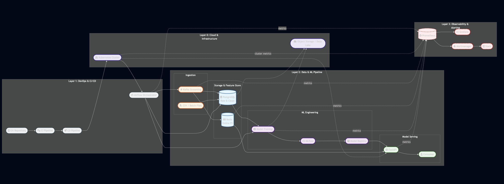

E-Commerce & Retail Supply Chain

## Diagram project structure:

# Use-Case

- Real‑time stockout alert
- Dynamic safety stock
- Near real‑time demand forecasting
- Supplier delay detection

# Project workflow

### 1) Dataset (CSV Sources)

- `products.csv`
- `suppliers.csv`
- `purchase_orders.csv`
- `daily_inventory.csv`
- `inventory_snapshot.csv`
- `sales.csv`

### 2) PostgreSQL Logical Schema

**raw** (data apa adanya dari CSV)

- raw.products
- raw.suppliers
- raw.purchase_orders
- raw.daily_inventory
- raw.inventory_snapshot
- raw.sales

**clean** (hasil cleaning & standardisasi)

- clean.products
- clean.suppliers
- clean.purchase_orders
- clean.daily_inventory
- clean.inventory_snapshot
- clean.sales

**mart / analytics** (siap feature & BI)

- mart.fact_sales
- mart.fact_inventory_daily
- mart.fact_inventory_snapshot
- mart.dim_product
- mart.dim_supplier
- mart.dim_date

---

### 3) Feature Store (example)

- **Inventory Features**
    - `stock_on_hand_7d_avg`
    - `stockout_flag`
    - `inventory_turnover`
- **Sales Features**
    - `sales_qty_7d`
    - `sales_qty_30d`
    - `price_discount_ratio`
- **Supplier Features**
    - `lead_time_avg`
    - `on_time_delivery_rate`

---

### 4) MLflow

- **Tracking**: experiment demand forecasting / replenishment
- **Artifacts**: model, metrics, feature schema
- **Registry**: Staging → Production

---

### 5) Kubernetes Runtime

- **Online**: REST API (FastAPI) untuk real‑time demand / reorder suggestion
- **Batch**: scheduled inference (harian) via CronJob

---

### 6) CI/CD Flow

1. Commit code (ETL / training / serving)
2. CI: unit test, data quality test, build Docker image
3. CD: deploy Airflow DAG / model service ke Kubernetes

## 7) Kafka (Real‑Time Supply Chain Extension)

Kafka ditambahkan untuk **event‑driven architecture**:

- Real‑time sales
- Inventory change
- Purchase order status

## 8) Slack Alerts (Monitoring & Incident Awareness)

### Important event is needing Slack Alert

| Layer | Event | Purpose |
| --- | --- | --- |
| Kafka | High Consumer | Data delay detection |
| Airflow | Failed DAG | Data is not progress |
| Data Quality | Missing / anomaly | Prevent garbage-in |
| MLflow | Model promoted | Awareness team |
| Inference | Error / spike | Business protect |

### Feature Store (Real‑Time Ready)

- Offline store: PostgreSQL (mart)
- Online store: Redis (opsional)

## 9) Notebook (Experiment models)

1️⃣ Demand Forecasting (Inti Supply Chain)

**Problem**

- Sales product per day / store / month
- Used for replenishment & inventory planning

| Model | Kapan Dipakai | Alasan |
| --- | --- | --- |
| **SARIMAX** | Stable product, long histories | Time-series Classsic, interpretative |
| **Supervised ML** (XGBoost, RF, Logistic Regression) | A lot of feature (promo, stock, supplier) | Catch non-linear |
| **Deep Learning (LSTM / TFT)** | Big scale, complex seasonability | Long-term dependency |

2️⃣ Inventory Optimization & Stockout

**Problem**

- Risk detect stockout
- Optimation safety stock

| Model | Tipe |
| --- | --- |
| Logistic Regression | Supervised |
| Random Forest | Supervised |
| Isolation Forest | Unsupervised |

3️⃣ Anomaly Detection (Fraud / Supplier Issue)

**Problem**

- Overfitting demand no logics
- Supplier delay extreme

| Model | Alasan |
| --- | --- |
| Isolation Forest | Cepat, robust |
| LOF | Density-based |
| Autoencoder | Complexity pattern |

4️⃣ Customer & Product Segmentation

**Problem**

- Segmentation product fast/slow moving
- Segmentation supplier
- Segmentation supplier

| Model | Tipe |
| --- | --- |
| KMeans | Unsupervised |
| DBSCAN | Unsupervised |
| PCA | Dimensionality reduction |

# Workflow Concepts

- Kafka = events
- PostgreSQL = truth
- Airflow = orchestration
- Feature Store = consistency
- MLflow = governance
- Prometheus = metrics
- Notebook = experiments model
- Grafana = visibility
- Alertmanager + Slack = response
- Kubernetes = scale
- CI/CD = velocity

## Logs progress

- Prepare venv python to fill requirements import
- Prepare database PostgreSQL to connect for
    - ingestion
    - validation
- Create schema in SQL for raw, clean, feature and mart SCHEMA table
    
    raw     → data lake (CSV dump)
    clean   → cleaning & validation result
    feature → feature store
    mart    → data ready for analytics / Machine Learning
    
- Mistaken must be prevented
    
    ❌ Load CSV directly from notebook
    
    ❌ Logic cleaning only in pandas
    
    ❌ nothing schema (`raw`, `clean`)
    
    ❌ doesn’t save metadata load
    
- Kafka = events
- PostgreSQL = truth
- Airflow = orchestration
- Feature Store = consistency
- MLflow = governance
- Prometheus = metrics
- Grafana = visibility
- Alertmanager + Slack = response
- Kubernetes = scale
- CI/CD = velocity